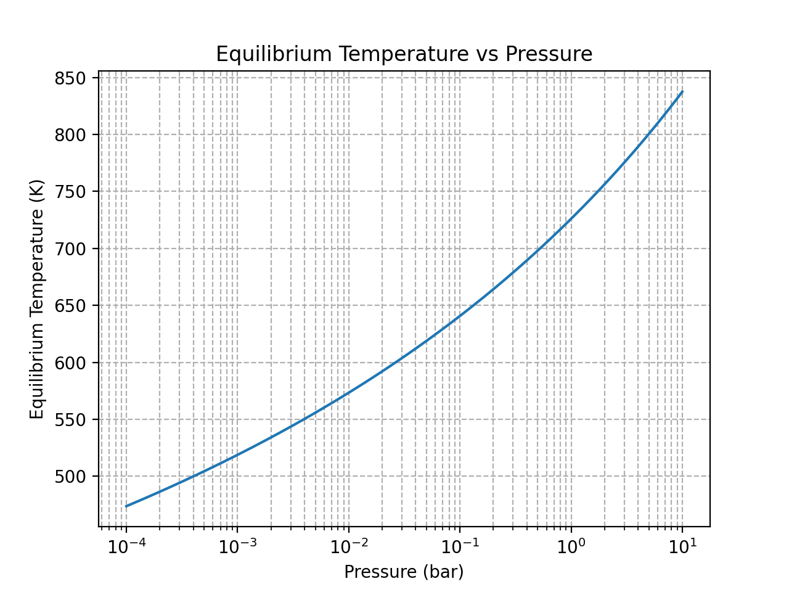
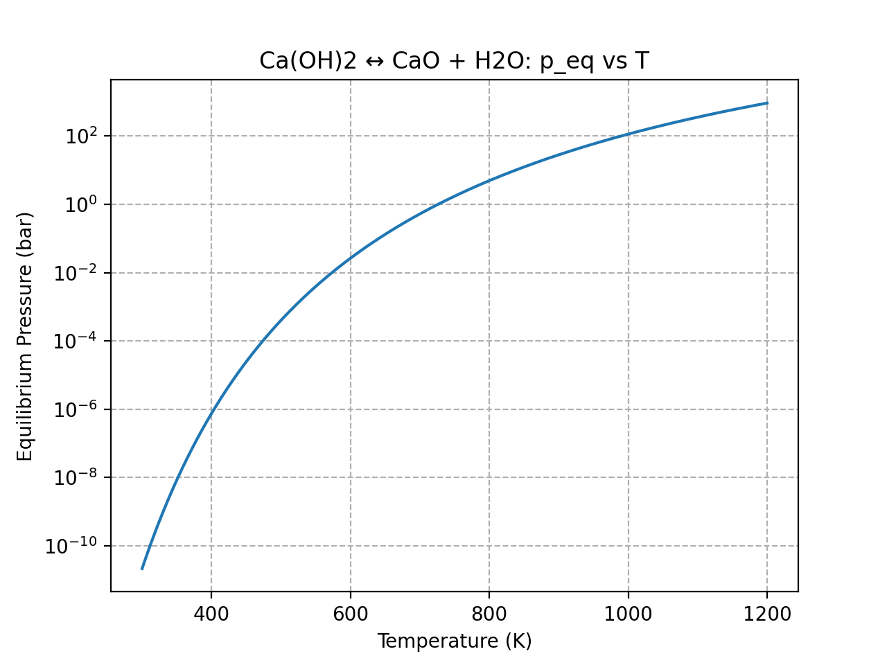

# Advanced Thermochemical Storage Simulation

## 📌 Overview
This project models a **high-temperature thermochemical heat storage system** with:
- **Reaction kinetics** to simulate material conversion over time.
- **Pressure tuning** to control output temperature.
- **Equilibrium modeling** for different operating conditions.

This approach allows matching the storage temperature to specific industrial process requirements.

## 🎯 Objectives
- Show how **pressure** influences equilibrium temperature.
- Model reaction conversion over time using **Arrhenius kinetics**.
- Provide insights into **design trade-offs** between speed, capacity, and output temperature.

## 🛠️ Methodology
1. Define thermodynamic parameters (ΔH, ΔS).
2. Implement Arrhenius equation for reaction rates.
3. Simulate charging and discharging with varying pressures.
4. Plot results for comparison.

## 📊 Key Results
- **Temperature–time graphs** for multiple pressures.
- Identification of optimal operating pressures for energy delivery.
- Quantitative understanding of how reaction kinetics impact usable storage.

## 📷 Example Output


## 🚀 How to Run
```bash
python advanced_thermochemical_storage.py
